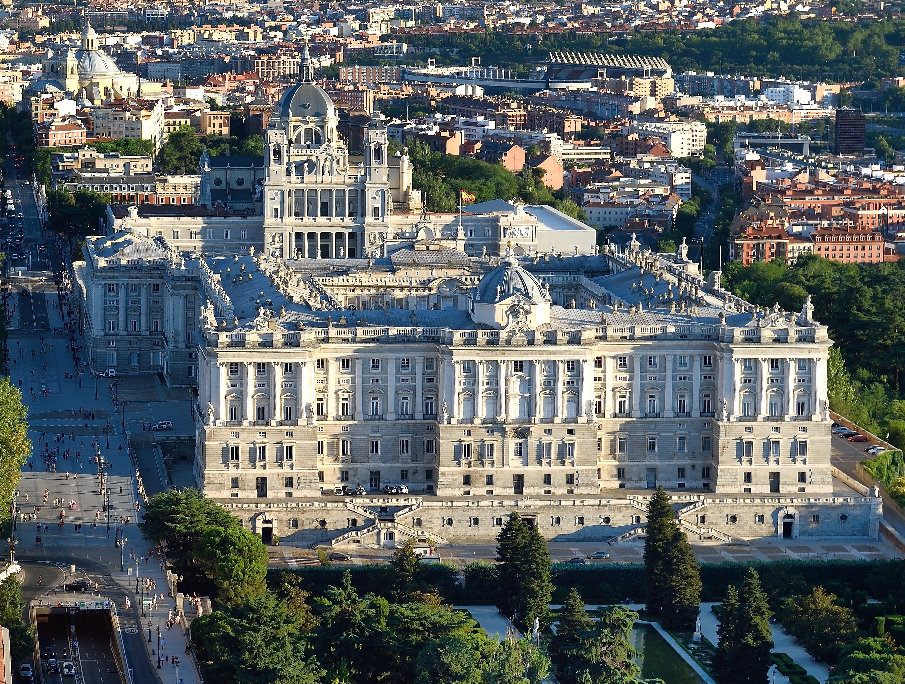
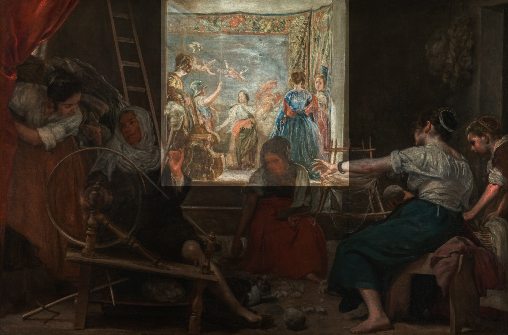
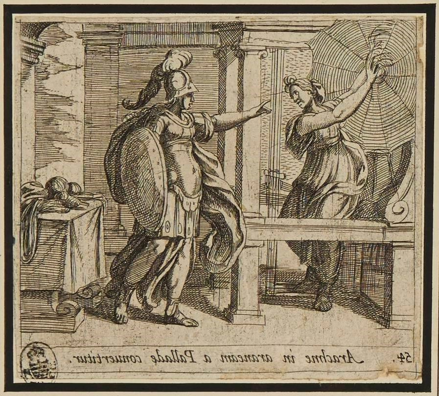

# Las Hilanderas  

[Quelle](https://www.museodelprado.es/coleccion/obra-de-arte/las-hilanderas-o-la-fabula-de-aracne/3d8e510d-2acf-4efb-af0c-8ffd665acd8d)

_um 1656,
Öl auf Leinwand, 220x289 cm,
Museo del Prado in Madrid_

Diese Syllabus Site dreht sich um Das Gemäle von Diego Velázquez und die Entschlüsselung dieses durch viele Kunsthistoriker im Laufe der Zeit. Als Hauptquelle dient hierbei das Buch mit dem Titel: „Aby Warburg und Fritz Saxl enträtseln Velázquez“ von Katrin Hellwig.

---

# WANN ist das Bild entstanden?

## Nach neuester Schätzung ist das Bild zwischen 1655 und 1660 entstanden. Damit gehört es definitiv zu den letzten Werken von Velázquez.
Es ist somit der Kunstepoche zuzuordnen. Die feine Ausarbeitung kleinster Details und vor allem die Darstellung des Lichtes sorgen für einen für damalige Verhältnisse unglaublichen Realismus.

## 

---

# WO hing das Bild und wo hängt es heute? 

## Palacio Buen Retiro Leonardo

[Quelle](https://de.wikipedia.org/wiki/Retiro-Park#/media/Datei:Palacio_Buen_Retiro_Leonardo.jpg)

_Schloss und Park Buen Retiro; Ölgemälde von Jusepe Leonardo, 1637._

Der frühste bekannte Hängungsort Der Buen Retiro Palacio ist die Sommerresidenz König Philip V.  (Herrschaftszeit 1700 - 1746). 

## Palacio Real de Madrid

[Quelle](https://de.wikipedia.org/wiki/Datei:Palacio_Real_de_Madrid_Julio_2016_(cropped).jpg)

_Palacio Real de Madrid Juli 2016 / Foto: Tim Adams_

Ab den 1770er Jahren hing es im damals neugebauten Palacio Real in Madrid

## Museo del Prado

[Quelle](https://gatetotravel.de/travel-guide/city/ziel/madrid/dontmisss/Museo-del-Prado)

Seit 1819 kann man das Gemälde im Museo del Prado in Madrid im Raum 115A bestaunen

---

# WER war Diego Velázquez?

## Selbstportrait

[Quelle](https://de.m.wikipedia.org/wiki/Datei:Vel%C3%A1zquez_Self-portrait.jpg)

_Diego Velázquez, vor 1660 Öl auf Leinwand, 58x40 cm_

## Daten

Geboren afang Juni 1599 in Sevilla  
Gestorben am 7. August 1660 in Madrid

## Sein Leben

-	In Sevilla wuchs er auf und erlernte das Kunsthandwerk
-	1622 begab er sich nach Madrid 
-	1623 wurde er Hofmaler von Philip V.
-	In dieser Zeit porträtierte er zahlreiche Mitglieder der königlichen Familie und Angehörige des Hofes
-	Er begab sich in dieser Zeit auf 2 Italienreisen und tauschte sich mit vielen anderen zeitgenössischen Künstlern aus
-	Velázquezs' Werke werden als die repräsentativsten und beeindruckensten Arbeiten des spanischen Barocks bezeichnet

---

# WAS ist zu sehen? 

## Im Vordergrund

Dargestellt ist ein Raum. Der erste Blick fällt auf eine Gruppe von drei Frauen, welche mit dem Herstellen von Garn beschäftigt sind.
Zu ihren Füßen sitzt eine Katze. Links dreht eine ältere Frau am Spinnrad, um aus Wolle Garn zu machen. Dabei neigt sie ihren Kopf nach links. 

Vom Betrachter abgewandt sitzt rechts im Bild eine jüngere und verarbeitet das Garn weiter indem sie es zu einem Knäul wickelt.

Zwischen den beiden sitzt, zentral im Bild und zum Betrachter gerichtet, eine dritte Dame, welche Rohwolle vom Boden aufsammelt. In der linken Hand hält sie einen Wollkamm, um die Rohwolle damit zu bearbeiten.

## Figuren am Rand

Zu diesen drei Figuren kommen zwei weitere an den Bildrändern hinzu. Eine am linken Bildrand, welche einen Vorhang beiseite schiebt, während sie augenscheinlich ein Gespräch mit der äteren führt.

Die andere befindet sich am rechten Bildrand, wo sie einen Korb neben der Garnwickelnden Frau abstellt.

## Der Hintergrund

Utensilien wie ein Wollknäuel, hochgestapelte Wolle am linken Bildrand sowie eine an der Wand lehnende Leiter charakterisieren den Raum als Spinnerei.
Ein weiterer Raum eröffnet sich durch eine Stufe nach hinten, wo sich drei elegant gekleidete Damen finden. Eine links am Bildrand an eine Viola de Gamba gelehnt.
Rechts stehen zwei weitere Damen. Eine mit dem Rücken zum Betrachter, die andere seitlich stehend den Kopf in Richtung des Betrachters geneigt.
Des weiteren sieht man hinter den drei eleganten Damen zwei weitere Figuren. Eine behelmte, den rechten Arm erhoben und ihr gegenüber eine junge Frau, die ihre Arme ausgebreitet hat und zu der behelmten Figur schaut. Bei diesen Figuren ist es nicht genau erkennbar, ob sie der Ebene der drei Damen angehören oder dem Wandteppich dahinter.
Da sie große Teile des Wandteppichs verdecken, könnten sie tatsächlich im Raum stehen, was jedoch dagegen spricht, sind die Unterschiede der Malweise dieser Figuren im Vergleich zu den anderen Figuren in den Räumen.
Was aber definitiv dem Wandteppich zuzuordnen ist, sind zwei fliegende Putti oben links sowie schemenhaft eine auf einem Stier reitende Frau mit einem wehenden roten Tuch.

## Viola de Gamba:

Gambe (oder Viola da gamba), früher auch Kniegeige, Beingeige oder Schoßgeige genannt, ist eine Sammelbezeichnung für eine Familie historischer Streichinstrumente. Sie entstand zur selben Zeit wie die Violinfamilie. Die Bezeichnung da gamba leitet sich von der Spielhaltung ab.  

[Quelle](https://musiculum.de/gambe/)

---

# Erste Deutungen

durch Antonio Ponz und Anton Raphael Mengs

## Antonio Ponz (1725–1792)

[Quelle](https://de.wikipedia.org/wiki/Antonio_Ponz#/media/Datei:Ponz-autorretrato.jpg)

_Antonio Ponz, 1774, Öl auf Leinwand, 43x36cm, Real Academia de Bellas Artes de San Fernando_

Antonio Ponz war ein spanischer Kunstschriftsteller. Er beschäftigte sich erstmals näher mit dem Bild, indem er die Räume des Palacio Real im Jahr 1772 beschrieb. 
Aus dieser Beschreibung geht hervor, dass das Bild schon damals eine gewisse Berühmtheit genoss.

## Anton Raphael Mengs (1728–1779)

[Quelle](https://en.wikipedia.org/wiki/Anton_Raphael_Mengs#/media/File:Mengs,_Selbstbildnis.jpg )

_Anton Raphael Mengs, 1773, Öl auf Holztafel, 93x73cm, Galleria degli Uffizi_

Im selben Jahrzehnt wie Ponz widmete sich auch der deutsche Maler Anton Raphael Mengs intensiv dem Gemälde. Er prägte unter anderem den noch heute gängigen Namen, indem er es in einem Brief an Ponz Ylanderas nennt.
Außerdem ordnete er das Bild als eines der letzten Werke von Velásquez ein und bewunderte seine Maltechnik. Das Bild sei laut ihm nicht mit der Hand, sondern allein mit dem Willen gemalt.

---

# 1800-1888

Bis 1888 wurde viel um das Entstehungsdatum gerätselt. Außerdem gab einige neue Erkenntnisse über die Technik des Malers.

## Katalogbeschreibung im Museo del Prado 1828

Die erste Beschreibung des Bildes im Museo del Prado beschrieb 1828 zunchst die Unterschiede der sozialen Orte im Bild.

Erhoben im Hintergrund werden die Damen als Señoras bezeichnet, während die arbeitenden Frauen im Vordergrund Mujeres genannt werden.

-	Senioras - bezeichnung für **Die Dame – direkte Anrede**
-	Mujeres - **eine Frau / irgendeine Frau**

## Céan Bermúdez 

Kurz nach 1800 verglich der spanische Kunstschriftsteller Céan Bermùdez die drei Garn spinnenden Frauen im Vordergrund mit Parzen.

- Parzen sind die drei **Schicksalsgöttinnen** Nona, Decima und Parca aus der römischen Mythologie. Laut dieser ist es ihre Aufgabe, das Schicksal der Menschen zu spinnen.
[Quelle](https://hainhofer.hab.de/register/personen/parzen)

  

## Pedro de Madrazo 

[Quelle](https://en.wikipedia.org/wiki/Pedro_de_Madrazo_y_Kuntz)

## Gregorio Cruzada Villaamil (1832 - 1884)

[Quelle](https://en.wikipedia.org/wiki/Gregorio_Cruzada_Villaamil#/media/File:Gregorio_Cruzada_Villaamil_-_carte_de_visite.jpg)

---

# Carl Justis Fragen

Justi spielte eine Schlüsselrolle in der Deutungsgeschichte des Gemäldes.  
Er bietete die Ansätze für Warburg und Saxl

## Seine Überlegungen zum Bild

-	Er stellt die Vermutung an, dass in dem Wandteppich eine Episode eines mythologischen Dramas zu sehen sei. Dahingehend greift er den Gedanken von Madrazo auf, interpretiert jedoch nicht weiter.	Die Frage, welche Szene genau dargestellt ist. lässt er Bewust offen.

## Stellt das Bild ein Schauspiel dar?

-	Diskrepanz zwischen Figuren auf dem Teppich, der Empore und den Arbeiterinnen führen zur Überlegung, dass es sich um ein Schauspiel handelt
-	Viola de Gamba deutet auf Musik für die Zwischenakte

## Eine mögliche Entstehungsgeschiichte des Bildes 

- Velazquez begleitet die 3  Damen im Hintergrund in seiner Rolle als Hofmarschall. Diese begutachteten die Teppiche im Hintergrund. Er findet die Gesamte Szenerie sehr faszinierend und hält diese als Skizze fest.

## Der meisterhafte Umgang mit dem Licht

Laut Justi ist der eigentliche Gegenstand des Bildes das Licht
-	Von hellen Körpern reflektiertes Sonnenlicht
-	Indirekt farbige Reflexlicht im Schatten
-	Durch Staubkörner gebrochene Sonnenstrahlen
-	Licht in den Speichen des schwingenden Rades

## Penelope und die Freier

[Quelle](https://www.nationalgallery.org.uk/paintings/pintoricchio-penelope-with-the-suitors)

_Pinturicchio, Penelope und die Freier, 1509, Fresko, 125x152 cm, London, National Gallery_

Justi führt Pinturicchios Penelope und die Freier an 

Auf dem Bild sitzt die Frau des Odysseus am Webstuhl. Des weiteren ist eine jüngere Frau beim kämmen von Wolle zu sehen.
Velázquez sei, indem er auf ein solches, die Arbeitsdarstellung motivierendes religiöses oder mythologisches Bildthema verzichtete, mit diesem „ältesten Arbeiter- oder Fabrikstück“ ein Wagnis eingegangen.
Da das Bild jedoch sehr guten Anklang und Bewunderung in der Gesellschaft erfuhr gelang ihm laut Justi ein Glücksgriff.

---

# Antworten auf diese Fragen

von Aby Warburg und Fritz Saxl

## Aby Warburg

[Quelle](https://de.wikipedia.org/wiki/Aby_Warburg)

Aby Warbunrg (1866-1929) war ein hamburger Kunsthistoriker und Professor an der Universität Hamburg

## Fritz Saxl

[Quelle](https://de.wikipedia.org/wiki/Fritz_Saxl)

Fritz Saxl (1890 - 1948) war ein österreuchischer Kunsthistoriker

## Die Fabel der Arachne

[Quelle](https://skd-online-collection.skd.museum/large/230/9da507b0-d794-4cc4-ac11-a49a7cc4f66d.jpg)

-	Warburg suchte in der „Metamorphosen“-Ausgabe von 1606 nach vergleichbaren Figuren. Er war in dieser bereits zu Rembrandt und Rubens Recherchen fündig geworden. Er deutete die Szene auf dem Teppich als Teil des Wettstreits zwischen Pallas Athene und Arachne. Genauer um den Teil kurz vor der Verwandlung von Arachne in eine Spinne, was ihre Bestrafung dafür sein sollte, dass sie sich und ihr Können über die Götter gestellt hat.

## Die Fabel erklärt 

Bilder sagen mehr als Worte.. Wer sich die Fabel also gern anschauen möchte kann dies unter diesem [Link](https://www.youtube.com/watch?v=XvUHcsZOhJ8) gerne tun.
Wem die Textform doch lieber ist oder nicht ganz so fit in englisch ist, bekommt hier noch eine kleine Zusammenfassung der Fabel:

Arachne war eine begabte Weberin aus Lydia, die behauptete, in ihrer Kunst niemanden über sich zu haben, nicht einmal die Göttin Athene. Diese Herausforderung nahm Athene an, und die beiden traten in einem Wettstreit gegeneinander an. Arachne webte ein Tuch, das die Fehltritte der Götter darstellte, was Athene erzürnte. Obwohl Athenes eigenes Werk perfekt war, konnte sie Arachnes Können nicht leugnen. In ihrem Zorn zerstörte Athene Arachnes Tuch und verwandelte sie zur Strafe in eine Spinne, damit sie für immer weben müsse.

---

# Fazit - Eine Allegorie der Webekunst

Das Bild hat im Laufe der Jahrhunderte einige Kunsthistoriker beschäftigt. Der aktuelle Kenntnisstand hier noch einmal zusammengefasst:
Das Ölgemälde gehört zum Spätwerk von Velázquez. Es stellt höchstwahrscheinlich eine reale Szene in einer Teppichwerkstatt in Madrid dar. Die Damen auf der Empore gehören ihrer Kleidung nach zu Urteilen dem spanischen Hof an. Sie bestaunen entweder Das Teppichbild oder aber ein Schauspiel, was vor diesem dargestellt ist. Diese Frage wird wohl weiterhin unbeantwortet bleiben. In jedem Fall handelt es sich um eine Szene der römisch griechischen Mythologie, in der Arachne für ihren Hochmut von Athene bestraft wird. Diese Fabel hat ebenso viel mit der Tätigkeit des Spinnens wie mit der Spinne selbst zu tun und schließt damit den Kreis zwischen Vorder- und Hintergrund des Bildes. Velázquez führt hier also völlig bruchlos eine Arbeiterszene, den höfischen Stand und antike Sagen auf einem Bild der Meisterklasse zusammen. Es wird gedeutet, dass Velázquez damit den stetigen Wettstreit in der Kunst und somit auch die kontinuierliche Weiterentwicklung dieser betont. 

---

<!--skipnav-->
 
 

[Contact](mailto:marian.doerk@fh-potsdam.de,philipp.proff@gmx.de?subject=Syllabus%20Site) · [Imprint](https://www.fh-potsdam.de/impressum) · *This is a [Syllabus Site](https://infovis.fh-potsdam.de/syllabus-site/)*
