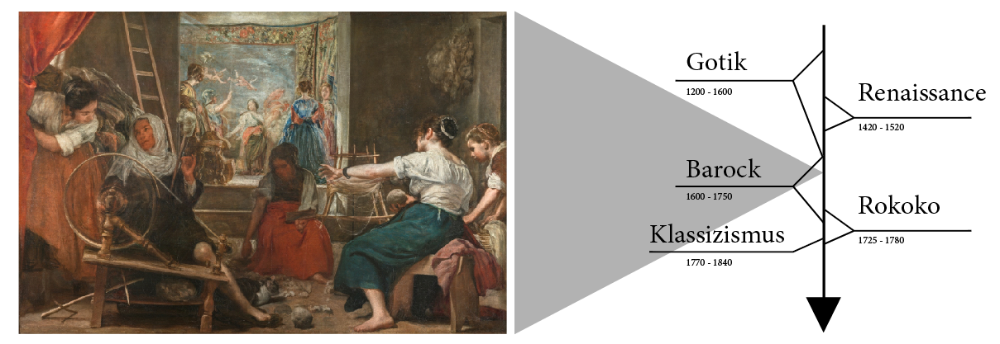
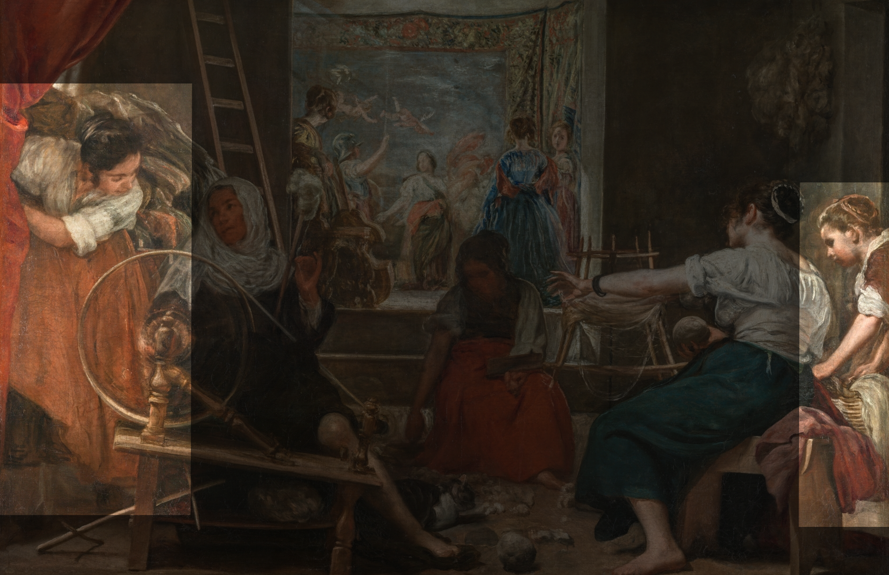
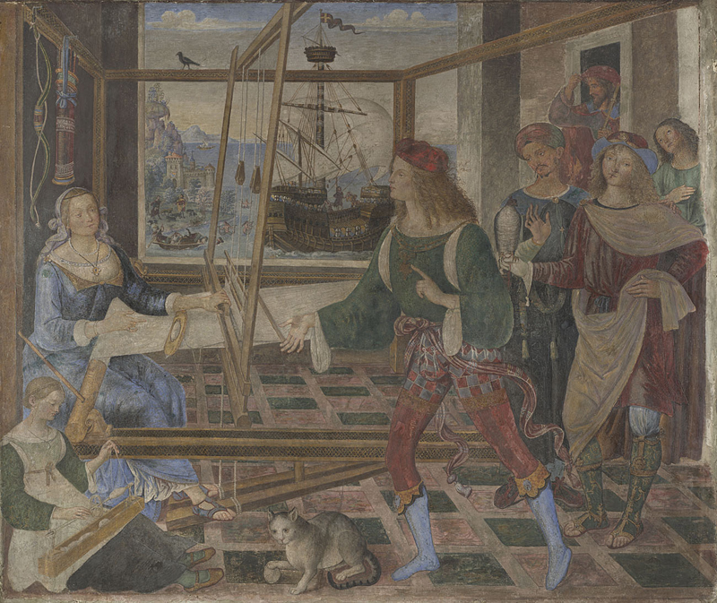

# Las Hilanderas  

[Quelle](https://www.museodelprado.es/coleccion/obra-de-arte/las-hilanderas-o-la-fabula-de-aracne/3d8e510d-2acf-4efb-af0c-8ffd665acd8d)

_um 1656,
Öl auf Leinwand, 220x289 cm,
Museo del Prado in Madrid_

Diese Syllabus Site dreht sich um Das Gemäle von Diego Velázquez und die Entschlüsselung dieses durch viele Kunsthistoriker im Laufe der Zeit. Als Hauptquelle dient hierbei das Buch mit dem Titel: „Aby Warburg und Fritz Saxl enträtseln Velázquez“ von Katrin Hellwig.

---

# WANN ist das Bild entstanden?

## 1655 - 1660

Nach den neuesten Schätzungen stammt dieses Gemälde aus der Zeit zwischen 1655 und 1660, und zählt somit zweifellos zu den späten Werken von Velázquez. Es ist eindeutig dem Barock zuzuordnen. Die akribische Ausarbeitung selbst der kleinsten Details und insbesondere die meisterhafte Darstellung des Lichts verleihen diesem Werk einen bemerkenswert hohen Realismus, für den Velázquez unter anderem berühmt war.

## 

---

# WO hing das Bild und wo hängt es heute? 

## Palacio Buen Retiro Leonardo

[Quelle](https://de.wikipedia.org/wiki/Retiro-Park#/media/Datei:Palacio_Buen_Retiro_Leonardo.jpg)

_Schloss und Park Buen Retiro; Ölgemälde von Jusepe Leonardo, 1637._

Als erster bekannter Hängungsort gilt Der Buen Retiro Palacio. Dieser ist die Sommerresidenz von König Philip V.  (Herrschaftszeit 1700 - 1746). 

## Palacio Real de Madrid

[_Palacio Real de Madrid Juli 2016 / Foto: Tim Adams_](https://de.wikipedia.org/wiki/Datei:Palacio_Real_de_Madrid_Julio_2016_(cropped).jpg)

Ab den 1770er Jahren hing es im damals neugebauten Palacio Real in Madrid.

## Museo del Prado

[Foto: SeanPavone](https://gatetotravel.de/travel-guide/city/ziel/madrid/dontmisss/Museo-del-Prado)

Seit 1819 kann man das Gemälde im Museo del Prado in Madrid im Raum 115A bestaunen.

---

# WER war Diego Velázquez?

## Selbstportrait

[_Diego Velázquez, vor 1660, Öl auf Leinwand, 58x40 cm_](https://de.m.wikipedia.org/wiki/Datei:Vel%C3%A1zquez_Self-portrait.jpg)

## Daten

Geboren anfang Juni 1599 in Sevilla.  
Gestorben am 7. August 1660 in Madrid.

## Sein Leben

Geboren und aufgewachsen ist Diego Rodríguez de Silva y Velázquez in Sevilla. Dort erlernte erlernte er schon in jungen Jahren das Kunsthandwerk. 1622 begab er sich nach Madrid und wurde dort schin ein Jahr später zum Holfmaler von Philip V. In dieser Zeit porträtierte er zahlreiche Mitglieder der königlichen Familie, sowie Angehörige des Hofes. Dieser Stand ermöglichteihm zwei Reisen nach Italien zu unternehmen und sich mit vielen zeitgenössischen Künstlern auszutauschen. Velázquez gilt mit seinen Werken als Vorreiter des spanischen Realismus. 

---

# WAS ist zu sehen? 

## Im Vordergrund

Dargestellt ist ein Raum. Der erste Blick fällt auf eine Gruppe von drei Frauen, welche mit dem Herstellen von Garn beschäftigt sind.
Zu ihren Füßen sitzt eine Katze. Links dreht eine ältere Frau am Spinnrad, um aus Wolle Garn zu machen. Dabei neigt sie ihren Kopf nach links. 

Vom Betrachter abgewandt sitzt rechts im Bild eine jüngere und verarbeitet das Garn weiter indem sie es zu einem Knäul wickelt.

Zwischen diesen beiden sitzt, zentral im Bild und zum Betrachter gerichtet, eine dritte Dame, welche Rohwolle vom Boden aufsammelt. In der linken Hand hält sie einen Wollkamm, um die Rohwolle damit zu bearbeiten.

## Figuren am Rand

Zu diesen drei Figuren kommen zwei weitere an den Bildrändern hinzu. Eine am linken Bildrand, welche einen Vorhang beiseite schiebt, während sie augenscheinlich ein Gespräch mit der äteren führt.

Die andere befindet sich am rechten Bildrand, wo sie einen Korb neben der Garnwickelnden Frau abstellt.

## Der Hintergrund

Die Szene wird durch charakteristische Utensilien wie ein Wollknäuel, hochgestapelte Wolle am linken Bildrand und eine an der Wand lehnende Leiter als eine Spinnerei gekennzeichnet.
Ein weiterer Raum öffnet sich durch eine Stufe nach hinten, in dem sich drei elegant gekleidete Damen befinden. Eine Dame lehnt sich links am Bildrand an eine Viola de Gamba.
Auf der rechten Seite stehen zwei weitere Damen. Die Eine im blauen Kleid steht mit dem Rücken zum Betrachter, während die Andere seitlich zu ihr steht und den Kopf in Richtung des Betrachters neigt.
Des Weiteren sind hinter den drei eleganten Damen zwei weitere Figuren zu sehen. Eine Figur mit einem metallischen Helm, den rechten Arm erhoben, und ihr gegenüber eine junge Frau, die ihre Arme ausgebreitet hat und zu der behelmten Figur schaut. 
Auf dem Wandteppich sind zwei fliegende Putti oben links sowie schemenhaft eine Frau zu sehen, die auf einem Stier reitet und ein wehendes rotes Tuch trägt.

## Die Ebenen des Bildes

Grundsätzlich kann man das Bild in drei Ebenen Teilen. Die erste bildet der Raum im Vordergrund, also der Raum, in dem Die Arbeiterinnen ihrem Handwerk nachgehen, dann durch die Stufew getrennt, der kleinere Raum im Hintergrund, wo sich die elegant gekleideten Damen befinden und zu guter Letzt der Wandteppich. Wenn man den Hintergrund betrachtet, fällt es dem Betrachter schwer, eindeutig zu erkennen, welche Figuren dem Hinteren Raum angehören und welche der Ebene des Wandteppichs zuzuordnen sind.

## Viola de Gamba

Gambe (oder Viola da gamba), früher auch Kniegeige, Beingeige oder Schoßgeige genannt, ist eine Sammelbezeichnung für eine Familie historischer Streichinstrumente. Sie entstand  zur selben Zeit wie die Violinfamilie. Die Bezeichnung "de Gamba" leitet sich von der Spielhaltung ab.  

[musiculum.de/gambe/](https://musiculum.de/gambe/)

---

# Erste Deutungen

durch Antonio Ponz und Anton Raphael Mengs

## Antonio Ponz 

[_Antonio Ponz, 1774, Öl auf Leinwand, 43x36cm, Real Academia de Bellas Artes de San Fernando_](https://de.wikipedia.org/wiki/Antonio_Ponz#/media/Datei:Ponz-autorretrato.jpg)

Antonio Ponz war ein **spanischer Kunstschriftsteller**. Er wurde **1725 in Bejís, Spanien geboren** und **verstarb 1792 in Madrid**. Im Zuge einer Beschreibung der Räume des Palacio Real im Jahr 1772 beschäftigte er sich erstmals näher mit dem Bild, 
Aus dieser Beschreibung geht hervor, dass das Bild **schon damals eine gewisse Berühmtheit genoss**.

## Anton Raphael Mengs 

[_Anton Raphael Mengs, 1773, Öl auf Holztafel, 93x73cm, Galleria degli Uffizi_](https://en.wikipedia.org/wiki/Anton_Raphael_Mengs#/media/File:Mengs,_Selbstbildnis.jpg )

Im selben Jahrzehnt wie Ponz widmete sich auch der deutsche Maler Anton Raphael Mengs, **geboren 1728** in Aussig, **gestorben 1779** in Rom intensiv dem Gemälde. Er prägte unter anderem den noch heute gängigen Namen, indem er es in einem Brief an Ponz **Ylanderas** nennt.
Außerdem ordnete er das Bild als **eines der letzten Werke** von Velásquez ein und bewunderte seine Maltechnik. Das Bild sei laut ihm nicht mit der Hand, sondern allein mit dem Willen gemalt.

---

# 1800-1888

Bis 1888 wurde viel um das Entstehungsdatum gerätselt. Außerdem gab einige neue Erkenntnisse über die Technik des Malers.

## Katalogbeschreibung im Museo del Prado 1828

Die erste Beschreibung des Bildes im Museo del Prado beschrieb 1828 zunächst die Unterschiede der sozialen Orte im Bild.  
Erhoben im Hintergrund werden die Damen als Señoras bezeichnet, während die arbeitenden Frauen im Vordergrund Mujeres genannt werden.

-	Senioras - bezeichnung für **Die Dame – direkte Anrede**
-	Mujeres - **eine Frau / irgendeine Frau**

## Céan Bermúdez 

Kurz nach 1800 verglich der spanische Kunstschriftsteller Céan Bermùdez die drei Garn spinnenden Frauen im Vordergrund mit **Parzen**.

Parzen sind die drei **Schicksalsgöttinnen Nona, Decima und Parca** aus der römischen Mythologie. Laut dieser ist es ihre Aufgabe, das Schicksal der Menschen zu spinnen.

[Quelle](https://hainhofer.hab.de/register/personen/parzen)

## Pedro de Madrazo 

[_Pedro de Madrazo y Kuntz, geboren 1816 in Rom, gestorben 1898 in Madrid, war ein spanischer Maler, Jurist, Schriftsteller, Übersetzer und Kunstkritiker._](https://en.wikipedia.org/wiki/Pedro_de_Madrazo_y_Kuntz)

In den 1870er Jahren vermutete Pedro er erstmals, das es sich bei den Figuren auf dem Wandteppich um eine **mythologische Szene** handeln muss. Welche Szene genau dargegestellt ist, kann er nicht feststellen. Grund dafür könnte der Mangel an Quellen zur Recherche sein.

## Gregorio Cruzada Villaamil

[Quelle](https://en.wikipedia.org/wiki/Gregorio_Cruzada_Villaamil#/media/File:Gregorio_Cruzada_Villaamil_-_carte_de_visite.jpg)

Im Zeitraum von 1880 - 1890 gab es einige neue Erkenntnisse zu Velázquez' Biografie. Gregorio Cruzada Villaamil, **geboren 1832 in Alicante (Spanien)** und **verstorben 1884 in Madrid**, brachte in dieser Zeit erstmals das Bild der Hilanderas mit Velázquez **Rolle als als „aposentador real“** (Hofmarschall) in Verbindung.
Teil seines Dienstes unter Philip V. war es demzufolge auch die Teppichmanufakturen gelegentlich zu besuchen und zu überwachen. Genauer soll es sich hierbei um **eine Teppichwerkstatt in der Calle Santa Isabel in Madrid** handen. Bei einem solchen Ausflug dorthin fing er dann die Komposition der Figuren und Objekte als Skizze ein, um daraus in seinem Atelier das Bild zu malen. 

---

# Carl Justis Fragen

Carl Justi spielte eine Schlüsselrolle in der Deutungsgeschichte des Gemäldes.  
Er bietete die Ansätze für Warburg und Saxl

## Carl Justi

_Scan aus "Die großen Deutschen im Bilde" (1936) von Michael Schönitzer_

[_Carl Justi war ein deutscher Philosoph und Kunsthistoriker, der 1832 in Marburg geboren wurde und 1912 in Bonn verstarb. Er spekulierte, dass auf dem Wandteppich eine Episode eines mythologischen Dramas dargestellt sein könnte. Obwohl er Madrazos Idee aufgreift, geht er nicht näher darauf ein. Er lässt absichtlich die Frage unbeantwortet, welche Szene genau zu sehen ist, genauso wie viele weitere Fragen._](https://de.wikipedia.org/wiki/Carl_Justi#/media/Datei:Carl_Justi.jpg)

## Stellt das Bild ein Schauspiel dar?

Die Diskrepanz zwischen Figuren auf dem Teppich, der Empore und den Arbeiterinnen führen Justi zur Überlegung, dass es sich um ein Schauspiel handelt. Außerdem deutet die Viola de Gamba auf Musik für die Zwischenakte einer solchen Aufführung.

## Eine mögliche Entstehungsgeschichte des Bildes 

Velazquez begleitet die drei  Damen im Hintergrund in seiner Rolle als Hofmarschall. Diese begutachteten die Teppiche im Hintergrund. Er findet die Gesamte Szenerie sehr faszinierend und hält diese als Skizze fest.

## Der meisterhafte Umgang mit dem Licht

Nach Justi ist das zentrale Thema des Gemäldes das Licht. Die Art und Weise, wie es von hellen Körpern reflektiert und indirekt farbiges Reflexlicht im Schatten erzeugt begeisterte ihn. Besonders faszinierend findet er des Lichtspiel in den Speichen des Spinnrades.

## Penelope und die Freier

[_Pinturicchio, Penelope und die Freier, 1509, Fresko, 125x152 cm, London, National Gallery_](https://www.nationalgallery.org.uk/paintings/pintoricchio-penelope-with-the-suitors)

Justi führt Pinturicchios Penelope und die Freier an.

Auf dem Bild sitzt die Frau des Odysseus am Webstuhl. Außerdem ist eine jüngere Frau zu sehen, die Wolle kämmt.
Velázquez wagte ein Experiment, indem er auf ein religiöses oder mythologisches Bildthema verzichtete, das normalerweise solche Darstellungen der Arbeit motiviert. Stattdessen bot er mit diesem „ältesten Arbeiter- oder Fabrikstück“ ein unübliches Bildthema.
Das Bild wurde in der Gesellschaft jedoch sehr gut aufgenommen und bewundert. Laut Justi gelang ihm damit ein Glücksgriff.

---

# Antworten auf diese Fragen

von Aby Warburg und Fritz Saxl

## Aby Warburg

[_Aby Warbunrg, geboren 1866 in Hamburg, gestorben 1929 auch in Hamburg war ein hamburger Kunsthistoriker und Professor an der Universität Hamburg._](https://de.wikipedia.org/wiki/Aby_Warburg)

## Fritz Saxl

[_Fritz Saxl, geboren 1890 in Wien, verstorben 1948 in Dulwich (England) war ein österreichischer Kunsthistoriker._](https://de.wikipedia.org/wiki/Fritz_Saxl)

## Die Fabel der Arachne

[Quelle](https://skd-online-collection.skd.museum/large/230/9da507b0-d794-4cc4-ac11-a49a7cc4f66d.jpg)

Warburg suchte in der „Metamorphosen“-Ausgabe von 1606 nach vergleichbaren Figuren. Er war in dieser bereits zu Rembrandt und Rubens Recherchen fündig geworden. Er deutete die Szene auf dem Teppich als Teil des Wettstreits zwischen Pallas Athene und Arachne. Genauer um den Teil kurz vor der Verwandlung von Arachne in eine Spinne, was ihre Bestrafung dafür sein sollte, dass sie sich und ihr Können über die Götter gestellt hat.

## Die Fabel erklärt 

Bilder sagen mehr als Worte.. Wer sich die Fabel also gern anschauen möchte kann dies unter diesem [Link](https://www.youtube.com/watch?v=XvUHcsZOhJ8) gerne tun.
Wem die Textform doch lieber ist oder nicht ganz so fit in englisch ist, bekommt hier noch eine kleine Zusammenfassung der Fabel:

Arachne war eine begabte Weberin aus Lydia, die behauptete, in ihrer Kunst niemanden über sich zu haben, nicht einmal die Göttin Athene. Diese Herausforderung nahm Athene an und die beiden traten in einem Wettstreit gegeneinander an. Arachne webte ein Tuch, das die Fehltritte der Götter darstellte, was Athene erzürnte. Obwohl Athenes eigenes Werk herrausragend war, konnte sie nicht leugnen, dass Arachnes Werk handwerklich besser war. In ihrem Zorn zerstörte Athene Arachnes Tuch und verwandelte sie zur Strafe in eine Spinne, damit sie für immer weben müsse.

---

# Fazit - Eine Allegorie der Webekunst

Das Bild hat im Laufe der Jahrhunderte einige Kunsthistoriker beschäftigt. Der aktuelle Kenntnisstand hier noch einmal zusammengefasst:
Das Ölgemälde gehört zum Spätwerk von Velázquez. Es stellt höchstwahrscheinlich eine reale Szene in einer Teppichwerkstatt in Madrid dar. Die Damen auf der Empore gehören ihrer Kleidung nach zu Urteilen dem spanischen Hof an. Sie bestaunen entweder Das Teppichbild oder aber ein Schauspiel, was vor diesem dargestellt ist. Diese Frage wird wohl weiterhin unbeantwortet bleiben. In jedem Fall handelt es sich um eine Szene der römisch griechischen Mythologie, in der Arachne für ihren Hochmut von Athene bestraft wird. Diese Fabel hat ebenso viel mit der Tätigkeit des Spinnens wie mit der Spinne selbst zu tun und schließt damit den Kreis zwischen Vorder- und Hintergrund des Bildes. Velázquez führt hier also völlig bruchlos eine Arbeiterszene, den höfischen Stand und antike Sagen auf einem Bild der Meisterklasse zusammen. Es wird gedeutet, dass Velázquez damit den stetigen Wettstreit in der Kunst und somit auch die kontinuierliche Weiterentwicklung dieser betont. 

---

<!--skipnav-->
 
 

[Contact](mailto:marian.doerk@fh-potsdam.de,philipp.proff@gmx.de?subject=Syllabus%20Site) · [Imprint](https://www.fh-potsdam.de/impressum) · *This is a [Syllabus Site](https://infovis.fh-potsdam.de/syllabus-site/)*
